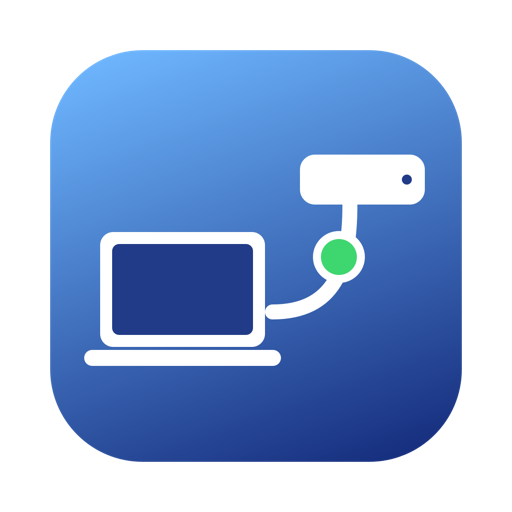
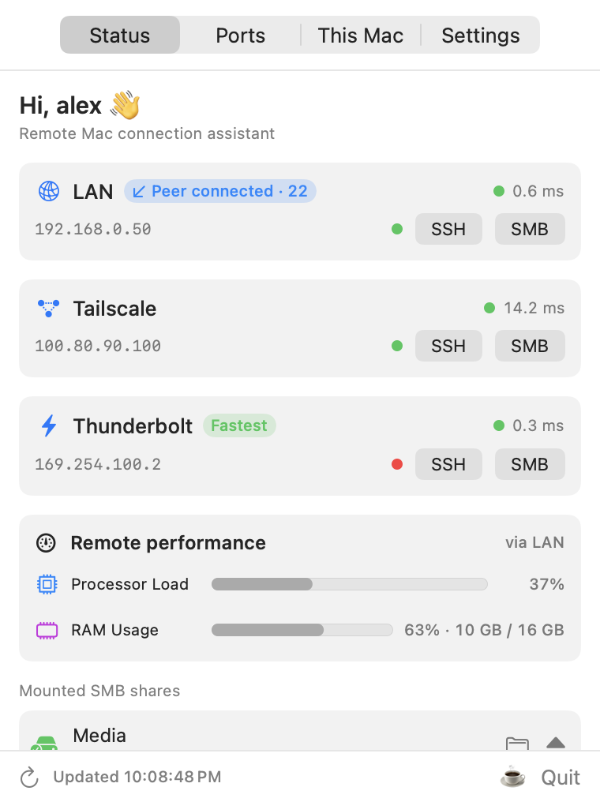
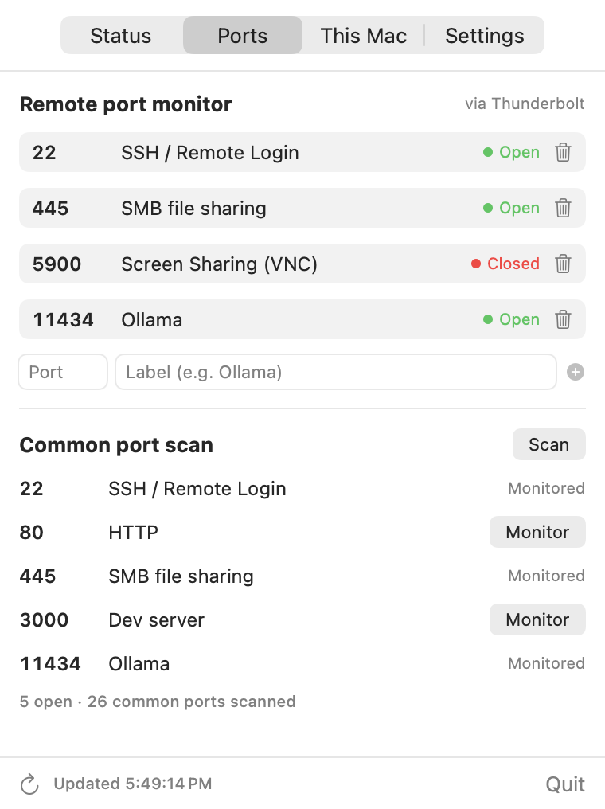
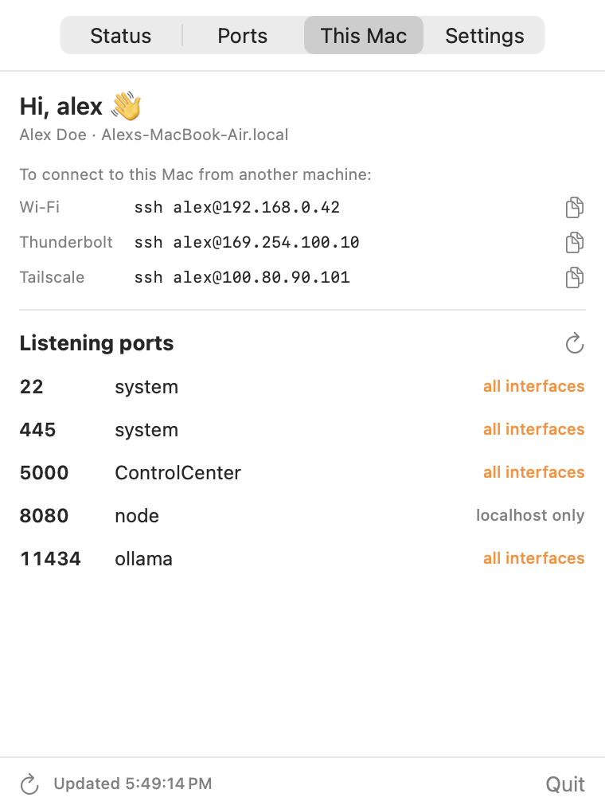
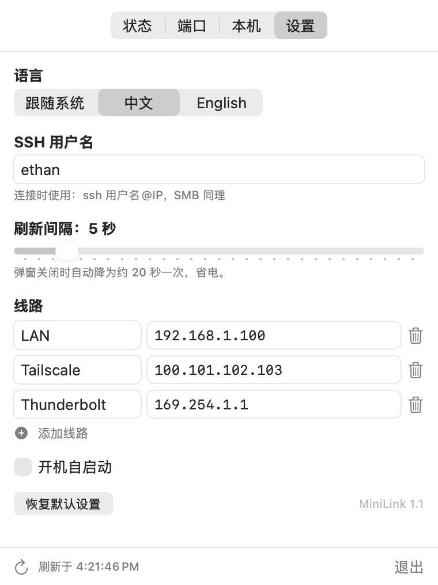

<p align="center">
  
</p>

<h1 align="center">MiniLink</h1>

<p align="center">
  A macOS <b>menu bar app</b> to monitor and connect to your remote Mac —<br>
  over <b>LAN, Tailscale, or Thunderbolt bridge</b> — with one-click <b>SSH & SMB</b>, live latency, and a built-in <b>port scanner</b>.
</p>

<p align="center">
  <a href="README.zh-CN.md">简体中文</a> · English
</p>

<p align="center">
  <a href="https://github.com/ethan6945/MiniLink/releases/latest"></a>
  
  
  
  
  
</p>

---

<p align="center">
  
</p>
<p align="center">
  
  
  
</p>

## Why?

If you run a **headless Mac mini / Mac Studio** as a home server, build machine, or AI box, you probably juggle several IPs for the same machine: the LAN address at home, a **Tailscale** address when you're out, maybe a **Thunderbolt bridge** for fast file transfers. Before every connection you wonder: *which route is up right now? Is the Thunderbolt cable even plugged in? Is SSH running? Did my SMB mount go stale after switching networks?*

MiniLink answers all of that at a glance from your menu bar — and connects you with one click.

## Features

- 🚦 **Multi-route status** — define any number of routes (LAN / Tailscale / Thunderbolt / VPN / …) to the same machine; each shows a live reachability dot, **ping latency**, and whether **SSH is actually up** on that route, with the fastest route badged
- ⚡ **One-click connect** — `SSH` opens Terminal with `ssh user@ip`; `SMB` mounts the share in Finder (credentials come from your Keychain)
- 🔄 **Inbound connection status** — see when the remote Mac (or anyone) is connected *to this machine* and on which service (SSH / SMB / VNC …), tagged to the route it came in on — handy for keeping an eye on a headless server
- 📊 **Remote performance** — see live processor load and RAM usage from the remote Mac over SSH; if needed, click the warning to create and install a dedicated MiniLink public key
- 🔌 **Port monitor** — watch the ports you care about (SSH 22, SMB 445, VNC 5900, or your own services) and see open/closed live, probed via the fastest reachable route
- 🔍 **Common port scan** — one click scans ~26 well-known ports (SSH, SMB, AFP, VNC, **Ollama, LM Studio, ComfyUI, Jupyter**, dev servers…) and lets you add discovered ports to the monitor list
- 💾 **SMB mount manager** — see currently mounted shares and **eject them in one click** (no more Finder hanging on a stale mount after a network switch)
- 🖥️ **"This Mac" tab** — your username, hostname, per-interface IPs as copy-ready `ssh user@ip` commands (for connecting *back* to this machine), plus all **local listening ports with process names** — instantly see what's exposed on all interfaces vs localhost-only
- 🌐 **English & 中文** — switchable in Settings, or follow the system language
- 🪶 **Native & tiny** — pure SwiftUI + Network.framework, no Electron, no dependencies, no telemetry; everything stays on your machine

## Download

Grab the prebuilt app — no Xcode needed:

1. Download **[MiniLink.zip](https://github.com/ethan6945/MiniLink/releases/latest/download/MiniLink.zip)** from the [latest release](https://github.com/ethan6945/MiniLink/releases/latest)
2. Unzip it, then drag `MiniLink.app` into **Applications**
3. Open it. macOS will warn "unidentified developer" (the app is ad-hoc signed, not notarized) — **right-click the app → Open** to confirm once, then it launches normally from then on

## Build from source

Requires Xcode Command Line Tools, macOS 14+:

```bash
git clone https://github.com/ethan6945/MiniLink.git
cd MiniLink
./build.sh
open build/MiniLink.app     # or drag it into /Applications
```

First run notes:

- The default route IPs are **examples** — open **Settings** in the popover and set your own IPs, SSH username, and routes (add/remove as many as you like)
- The first time you click **SSH**, macOS asks for permission to control Terminal — click Allow
- For **Launch at login**, run it from `/Applications`

## CLI self-check

The same binary doubles as a command-line network check — handy for scripts and debugging:

```bash
./build/MiniLink.app/Contents/MacOS/MiniLink --check
```

```
== Routes ==
LAN 192.168.1.100: reachable 0.3 ms
Tailscale 100.101.102.103: reachable 0.6 ms
Thunderbolt 169.254.1.1: unreachable
== Ports (via LAN 192.168.1.100) ==
22 SSH / Remote Login: open
445 SMB file sharing: open
```

## How it works

- **Latency**: one ICMP ping per route per refresh (`/sbin/ping` subprocess) — no special privileges needed
- **Remote performance**: one non-interactive SSH command reads macOS `top` and `sysctl` through the fastest SSH-capable route
- **Port probes**: TCP handshake via `Network.framework` `NWConnection` with a 2 s timeout
- **Local ports**: `netstat` for the complete listener list, `lsof` to annotate process names
- **Mounts**: parsed from `mount`, ejected via `NSWorkspace`
- Checks run concurrently and pause to a slow cadence while the popover is closed

## Use cases

Headless Mac mini home server · remote access to your Mac over Tailscale · Thunderbolt IP bridge between two Macs · monitoring an Ollama / LM Studio / ComfyUI machine · checking which route is fastest before a big SMB file transfer · quickly seeing what ports your Mac exposes on the network.

## Support ☕

MiniLink is free and open source. If it saves you time, consider buying me a coffee — it keeps the project going!

[](https://buymeacoffee.com/ethan6945)

## License

[MIT](LICENSE) © Ethan Tan
